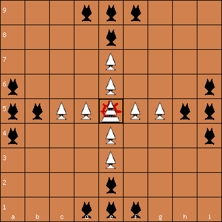

# Rules of Hnefatafl

## Historical Hnefatafl (Saami Tablut)

### Basics

Played on a 9x9 board with 1 King, 8 defenders and 16 attackers 

Attackers' side moves first

Pieces move like rooks in chess

### Throne (center square):
Cannot be occupied by anyone but the King. It is hostile so it can take part in a capture, except when it is occupied, then it isn't hostile to defenders.

### Defenders win: 
* King reaches an edge square.

### Attackers win: 
1. Capture the King. Can be done like every other piece except for when he is on the throne or next to it, then he needs to be surrounded on all four sides. 
2. If the attackers surround ALL of the defenders.

### Repetitions:
A player who aggressively maintains a board repetition must find another move or lose the game.

### If a player cannot move, he loses the game

--- 

## Copenhagen Hnefatafl

Played on a 11x11 board with 1 King, 12 defenders and 24 attackers 

### King can take part in captures

### Corners and throne are hostile

### Defenders win:
* King reaches a corner square.
* If the white pieces create an "edge fort", i.e. the King must be on an edge square, the King must be able to move and the fort must be impregnable to attack. If a fort is created and is impregnable to attack but the King is not on an edge or the King can't move, that results in a draw.

### Attackers win:
Same as in Historical Hnefatafl but the King can only be captured by surrounding on all 4 sides, wherever he is.
